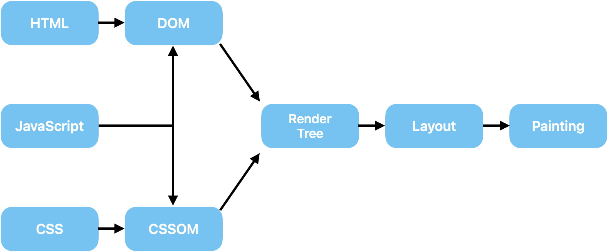

# Reflow와 Repaint
## 브라우저 렌더링 과정

1. HTML 파싱 (Parsing)
    - 브라우저는 HTML 문서를 위에서 아래로 읽으며 **DOM(Document Object Model)** 을 생성
    - `<script>` 태그를 만나면 파싱이 중단되고, 자바스크립트를 다운로드하고 실행됨.
        - 자바스크립트가 DOM을 조작하면 브라우저는 DOM 트리를 업데이트
        - 이로 인해 렌더링이 지연될 수 있음
2. CSS 파싱 (Parsing)
    - HTML에서 연결된 CSS 파일이나 `<style>` 태그를 읽어 **CSSOM(CSS Object Model)** 을 생성
    - CSSOM은 DOM과 결합하여 렌더 트리(Render Tree)를 생성
        - CSSOM 생성이 완료되지 않으면 렌더링이 지연될 수 있음
3. Render Tree 생성
    - 브라우저는 DOM과 CSSOM을 결합하여 Render Tree를 생성
        - Render Tree는 화면에 표시할 요소와 스타일 정보만 포함
        - 예: `display: none`인 요소는 제외.
4. JavaScript 실행
    - 자바스크립트가 DOM이나 CSSOM을 조작할 수 있으므로 렌더링 과정에 강한 영향을 미침
        - DOM 조작 : `document.createElement`, `innerHTML` 등으로 DOM을 동적으로 수정.
        - 스타일 조작: `element.style`로 CSS 속성 변경.
        - **중요**: 자바스크립트 실행 중 DOM이나 CSSOM이 변경되면 렌더 트리, Layout(Reflow), Paint(Repaint) 과정이 반복될 수 있음.
5. Layout (Reflow)
    - Render Tree를 기반으로 각 요소의 크기와 위치를 계산
    - 자바스크립트가 레이아웃 속성(예: `width`, `height`, `margin`)을 변경하면 Reflow가 발생
        - 비용이 커 최적화 필요
6. Paint (Repaint)
    - 계산된 레이아웃에 따라 색상, 텍스처, 그림자 등을 화면에 그림.
    - 자바스크립트가 스타일 속성(예: `background-color`, `color`)을 변경하면 Repaint가 발생
7. Composite (합성)
    - 브라우저는 여러 레이어를 결합(Composite)하여 최종 화면을 그림.
    - 자바스크립트로 `transform`, `opacity`, `will-change`를 변경하면 GPU가 레이어 합성을 처리해 성능을 최적화
## Reflow와 Repaint란?
- Reflow
    - 요소의 레이아웃(위치, 크기 등)이 변경되면 Reflow가 발생
    - 예: 창 크기 변경, DOM 구조 변경, 글꼴 변경.
    - 비용이 큼. 전체 렌더링 트리를 다시 계산해야 할 수도 있음.
- Repaint
    - 레이아웃은 변하지 않고, 색상이나 텍스처와 같은 스타일만 변경되었을 때 발생
    - 예: 배경색 변경, 텍스트 색 변경.
    - 비용이 Reflow보다 적음.
## 추가 개념
1) Layout 변경
    - 요소 추가/삭제, 크기 조정 등이 발생하면 Layout 변경이 일어나고 Reflow가 트리거 됨.
    - Reflow는 복잡한 계산이 필요하므로 성능에 영향을 미침.
2) 레이어 생성
    - 브라우저는 특정 CSS 속성(예: `position: fixed`, `transform`)을 가진 요소에 대해 별도의 레이어를 생성
    - 레이어는 독립적으로 관리되며, 변경 시 전체 페이지가 아닌 해당 레이어만 다시 그릴 수 있어 성능 최적화에 유리
3) GPU 가속
    - CSS에서 `transform`, `opacity`, `will-change` 등을 사용하면 브라우저가 GPU를 활용해 성능을 개선할 수 있음
    - GPU는 화면 합성을 빠르게 처리하므로 스크롤과 애니메이션 성능이 향상됨
4) 성능 최적화
- Reflow와 Repaint를 최소화하기 위한 팁:
    1. CSS와 DOM 변경을 최소화하기
    2. 애니메이션에는 transform과 opacity를 사용하기
    3. 복잡한 레이아웃 작업을 `display: none`으로 숨긴 뒤 수행하기
    4. 리플로우가 발생하는 연산(예: `offsetHeight`)은 한 번에 처리하기
