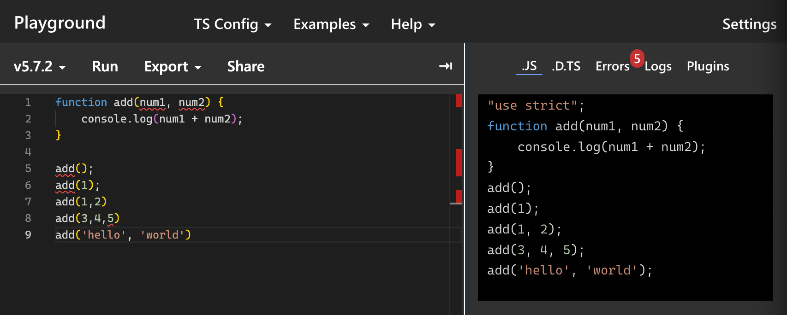

# TypeScript
목차
1. [타입스크립트를 사용하는 이유](#01-타입스크립트를-사용하는-이유)
2. [기본 타입](#02-기본-타입)


# 01 타입스크립트를 사용하는 이유

## TypeScript
- 우리가 사용하는 브라우저들은 타입스크립트를 이해하지 못하기 때문에 JavaScript를 거쳐서 로드해야 브라우저에 출력할 수 있음
- 그럼 번거로울텐데 왜 타입스크립트를 사용할까?
```js
function add(num1, num2) {
    console.log(num1 + num2);
}

add(); 
```
- 이렇게 작성하면 undefind와 undefind를 더 하니 NaN가 출력됨
```js
add(1);
```
- 동일하게 NaN
```js
add(1,2) // 3
add(3,4,5) // 7
add('hello', 'world') // 'helloworld'
```
- 여기서 `add(1,2)`를 제외하고는 의도한 대로 사용되지 않았음.
- 그러나 자바스크립트는 문제를 알려주지 않고 그대로 실행함.
```js
function showItems(arr) {
    arr.forEach((item) => {
        console.log(item);
    });
}

showItems([1,2,3])
showItems(1,2,3)
```
- javascirpt는 동적언어이기에 런타임에 타입을 결정하고 오류를 발견함.
- java, TypeScirpt와 같은 정적 언어는 컴파일 타임에 타입이 결정되어 오류를 발견함.
    - 때문에 코드 작성 시간이 길어지는 대신 초기에 생각을 많이 하여 코드를 작성한다면 안정적이고, 빠르게 작업을 완료할 수 있음

## TypeScirpt 실습
[TypeScriptLang](https://www.typescriptlang.org/play/?#code/PTAEHUFMBsGMHsC2lQBd5oBYoCoE8AHSAZVgCcBLA1UABWgEM8BzM+AVwDsATAGiwoBnUENANQAd0gAjQRVSQAUCEmYKsTKGYUAbpGF4OY0BoadYKdJMoL+gzAzIoz3UNEiPOofEVKVqAHSKymAAmkYI7NCuqGqcANag8ABmIjQUXrFOKBJMggBcISGgoAC0oACCbvCwDKgU8JkY7p7ehCTkVDQS2E6gnPCxGcwmZqDSTgzxxWWVoASMFmgYkAAeRJTInN3ymj4d-jSCeNsMq-wuoPaOltigAKoASgAywhK7SbGQZIIz5VWCFzSeCrZagNYbChbHaxUDcCjJZLfSDbExIAgUdxkUBIursJzCFJtXydajBBCcQQ0MwAUVWDEQC0gADVHBQGNJ3KAALygABEAAkYNAMOB4GRonzFBTBPB3AERcwABS0+mM9ysygc9wASmCKhwzQ8ZC8iHFzmB7BoXzcZmY7AYzEg-Fg0HUiQ58D0Ii8fLpDKZgj5SWxfPADlQAHJhAA5SASPlBFQAeS+ZHegmdWkgR1QjgUrmkeFATjNOmGWH0KAQiGhwkuNok4uiIgMHGxCyYrA4PCCJSAA)
- 위 페이지에서 별도의 설치 없이 타입스크립트를 실습해볼 수 있음
### 첫 번째 예제

- 예제로 만들었던 코드를 위와 같이 작성하면 오류가 있는 부분에 빨간 줄이 생기는 것을 볼 수 있음
- num1에 마우스를 올려놓으면 any라고 떠있는 것을 볼 수 있는데, 이는 타입이 any로 아무 타입도 아니여서 어떠한 타입도 들어올 수 있는 상태를 말함
- 타입은 웬만하면 any를 사용하지 않는 것이 좋음
- 그리고 아래에 오류가 난 것에 마우스를 올려놓으면 왜 오류가 발생하였는지를 알려줌
    - 인수를 2개 넣어야 하는데 1개만 넣었거나, 3개를 넣었거나 ... 등
```js
function add(num1:number, num2:number) {
```
- 먼저 타입을 설정하기 위해 위와 같이 number 타입을 설정해줌.
```js
function add(num1:number, num2:number) {
    console.log(num1 + num2);
}

// add(); 
// add(1);
add(1,2) 
// add(3,4,5) 
// add('hello', 'world')
```
- 나머지 타입이 안맞거나, 인수가 부족 혹은 과다한 코드들은 주석처리
- 함수가 만들 때에 의도한 것과 다른 함수들은 모두 에러라고 판단됨

### 두 번째 예제
```js
function showItems(arr) {
    arr.forEach((item) => {
        console.log(item);
    });
}

showItems([1,2,3])
showItems(1,2,3)
```
- 두 번째 예제 또한 하나씩 수정해보기.
```js
function showItems(arr:number[]) {
    arr.forEach((item) => {
        console.log(item);
    });
}

showItems([1,2,3])
// showItems(1,2,3)
```
- arr의 타입을 설정하기 (숫자로 된 배열)
## TypeScript를 사용하는 이유
- 위와 같은 이유로 타입스크립트는 정적으로 타입을 체킹하여 코드 가독성과 유지보수성 향상에 도움을 주기 때문에 사용함.
- 조금 더 구체적으로 살펴보자면 다음과 같음
1. 정적 타입 체킹
    - 코드를 작성하는 시점에 타입을 검사하여 런타임 오류를 줄임
    - 변수, 함수, 객체 등의 타입을 명시적으로 정의하여 개발 과정에서 타입 관련 버그를 사전에 방지할 수 있음
2. 코드 가독성과 유지보수성 향상
    - 타입이 명시적으로 지정되어 있어 코드의 의도를 쉽게 파악할 수 있음
    - 코드의 구조와 데이터 타입을 명확히 이해할 수 있어 팀원 간 협업과 유지 보수가 용이함
3. IDE 지원 및 생상성 향상
    - 풍부한 InstelliSense(자동완성, 타입 힌트, 문서 보기 등)를 제공하여 개발 속도를 높임
    - 코드 작성 중에 오류를 미리 감지하고, 리팩토링 작업을 더 안전하게 수행할 수 있음
4. 대규모 애필리케이션에 적합
    - 타입스크립트는 코드가 커지고 복잡해질수록 더 큰 장점을 제공
    - 인터페이스, 제네릭, 네임스페이스 등을 사용하여 복잡한 코드베이스를 체계적으로 관리할 수 있음

# 02 기본 타입

## 기본형
```js
let car:string = 'bmw';

car = 3;
```
- 위와 같이 문자형으로 지정해놓은 형식에 숫자를 넣으려고 하면 오류가 발생함.

```js
let car = 'bmw';
```
- 이 때 문자형으로 지정해주지 않아도 bmw가 문자형으로 되어있기 때문에 car에 마우스를 올려보면 string 타입으로 지정되어 있음
- 이런 것을 타입 추론이라고 함
```js
let age:number = 30;
let isAdult:boolean = true;
let a:number[] = [1,2,3];
let a2:Array<number> = [1,2,3];
```
- 이와 같은 형식들이 존재함

## 튜플 (Tuple)
```js
let b:[string, number];

b = ['z', 1];
// b = [1. 'z'];

b[0].toLowerCase();
b[1].toLowerCase(); // 오류
```
- 튜플은 배열과 같은 모양인데, 배열과 같은 상황에서 안에 들어 있는 요소의 형태가 다를 때 사용할 수 있음
- 위치별로 형태를 지정

## void, never
- void는 함수에서 아무것도 반환하지 않을 때 사용
```js
function say/Hello():void{
    console.log('hello');
}
```
- 이처럼 return 값이 없는, 즉 아무것도 반환하지 않는 함수의 경우 void를 사용할 수 있음
```js
function showError():never{
    throw new Error();
}

function infLoop():never{
    while (ture) {
        // do Somthing...
    }
}
```
- never의 경우 Error를 반환하거나 while과 같이 영원히 끝나지 않는 함수의 경우 사용할 수 있음.

## enum
- 자바스크립트에는 없고, 자바에는 있는 형태
    - 비슷한 값들끼리 묶어주는 것이라고 생각하면 됨
```js
enum Os {
    Window,
    Ios,
    Android
}
```
- enum에 값을 주지 않으면 0부터 값을 할당하고 다음 요소는 1씩 증가하며 자동으로 값을 할당함.
```js
enum Os {
    Window = 3,
    Ios,
    Android
}
```
- 예로 Window에 3을 할당하면, Ios는 1추가 된 값인 4가 할당되고, Android는 5가 할당됨
- 전 값에 +1한 값이 할당

## null, undefind
```js
let a:null = null;
let b:undefind = undefind;
```
